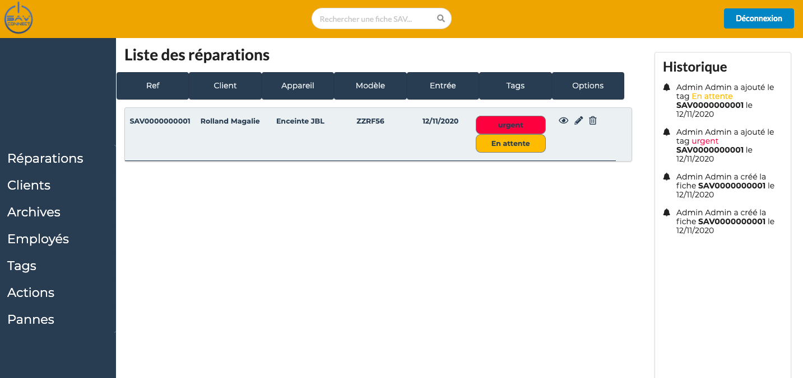

# SAV Connect front-end 

## Front-end application connected with a REST API created with Node js and deployed on AWS Cloudfront.

### SavConnect is an application built to help Repair Companies to "computerize" thier repair sheets.
- There are two roles available to access the application: an admin role to manage all the configurations( create tags, actions, etc.) and an user role which will only allow you to create repair sheets and archive them.
- When connected, you will access the dashboard which presents all the repairs in progress with its options.

- The front part is built with React Js. I choose to use React hooks to manage the state, Semantic-ui to make the forms, buttons, and cards, Sass to manage the stylesheet, and some React components for QrCode, dateTime picker, etc.

- In order to get or post data, the front part is connected to a rest API that I built with Postgres Database with Node and Express: [sav-connect-server](https://github.com/Stellavilar/sav-connect-server).

